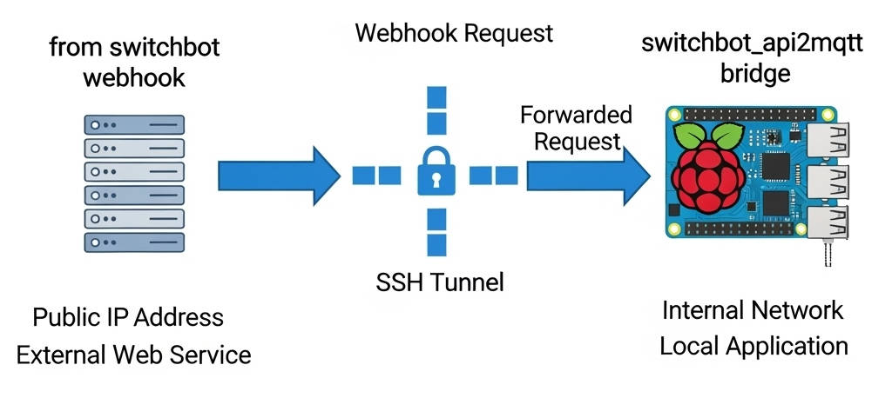

# switchbot-api2mqtt

This Python script acts as a bridge between **SwitchBot's cloud APIs** (1.1 version) and the **MQTT protocol**.

It allows you to seamlessly integrate your SwitchBot devices, such as smart locks, into your existing smart home ecosystem that supports MQTT, like OpenHAB.

Designed for ease of deployment, this solution can be run natively or as a Docker container, providing a portable and consistent environment.

By translating commands and status updates between SwitchBot's proprietary API and standard MQTT messages, this solution enables you to control and monitor your SwitchBot devices directly from your MQTT-enabled smart home platform. This eliminates the need for separate apps or complex workarounds, providing a unified and efficient control experience.

Tested on Smart Lock Pro device

***Please, use version 0.1 if you would like to control your smart lock pro in a simple way***

***Please, use version 0.2 if you would like to operate in a generic way***

## Usage

- Copy *.env-template* in *.env* and populate config variables according to your setup (see .env.example for help)
- Make the appropriate changes to the logging.json file for management of application log
- Follow this guide to obtain your authentication secrets: https://github.com/OpenWonderLabs/SwitchBotAPI?tab=readme-ov-file#getting-started
- Run switchbot_api2mqtt.py using your python environment OR run with docker compose
- Send commands to *MQTT_SMARTLOCK_BASE_TOPIC/[deviceid]/cmnd* topic to interact with smartlock devices. Payload is a plain string with command name. Responses will be published on *MQTT_SMARTLOCK_BASE_TOPIC/[deviceid]/response* topic
- Send generic GET and POST call to Switchbot API to *MQTT_GENERIC_BASE_TOPIC* topic using an MQTT publisher. Responses will be published on *MQTT_GENERIC_BASE_TOPIC/response* topic
- Webhook events will be published on *MQTT_SMARTLOCK_BASE_TOPIC/[deviceid]/event* topic
- It is possible to enable a polling thread to obtain state information periodically (this is mandatory to periodically update battery information not managed by webhooks)

### Payload template for generic GET/POST call

{"method": "[get/post]", "service": "[path_url]", "payload": ["generic_payload_for_POST_call"]}

### Environment configuration

- *MQTT_BROKER*=**mqtt broker ip address**
- *MQTT_PORT*=**mqtt broker port**
- *MQTT_USERNAME*=**mqtt broker username (if needed)**
- *MQTT_PASSWORD*=**mqtt broker password (if needed)**
- *MQTT_CLIENT_ID*=**mqtt_client_id**
- *MQTT_SMARTLOCK_BASE_TOPIC*=**base topic for smart lock pro interaction**
- *MQTT_GENERIC_BASE_TOPIC*=**base topic for generic api interaction**
- *SWITCHBOT_TOKEN*=**switchbot authentication token** see https://github.com/OpenWonderLabs/SwitchBotAPI?-tab=readme-ov-file#getting-started
- *SWITCHBOT_SECRET*=**switchbot authentication secret** see https://github.com/OpenWonderLabs/SwitchBotAPI?-tab=readme-ov-file#getting-started
- *API_BASEURL*=**switchbot api base url**
- *HTTP_PORT*=**http port listening for webhook events**
- *SWITCHBOT_VALID_DEVICE_TYPES*=**array of valid device types managed by bridge** see https://github.com/-OpenWonderLabs/SwitchBotAPI?tab=readme-ov-file
- *SWITCHBOT_VALID_DEVICE_ID*=**array of valid device id managed by bridge**
- *SWITCHBOT_SMARTLOCK_VALID_COMMAND*=**array of valid smartlock commands managed by bridge**
- *SWITCHBOT_POLLING_INTERVAL_SEC*=**polling interval in seconds. 0 means no polling**

### MQTT Topics

- *MQTT_SMARTLOCK_BASE_TOPIC/[deviceid]/cmnd*=**to send command to smart lock pro device**
- *MQTT_SMARTLOCK_BASE_TOPIC/[deviceid]/response*=**to receive command response from smart lock pro device**
- *MQTT_SMARTLOCK_BASE_TOPIC/[deviceid]/event*=**to receive webhook events from smart lock pro device**
- *MQTT_GENERIC_BASE_TOPIC/cmnd*=**to send generic get/post call to switchbot api**
- *MQTT_GENERIC_BASE_TOPIC/response*=**to receive response from switchbot api generic get/post call**

### WEBHOOK configuration

A simple video about webhook: https://youtu.be/FxlmHL5eWR8

To enable webhook integration you must configure webhook using API. See https://github.com/OpenWonderLabs/SwitchBotAPI?tab=readme-ov-file#webhook

So that webhook can work you need to have a public url to receive events.

This can be directly managed by this bridge or by a frontend http server which through Reverse Proxy forwards requests to this bridge.

It is important to know and manage security aspects before exposing services on the internet.

As an example, this is a valid setup:

- *Reception of the Webhook (Cloud Server)*: Switchbot webhook calls are sent to the public url of your cloud server (for example, http://www.example.com/switchbot_webhook). Being the server publicly accessible, it is able to receive these requests from Switchbot.
- *SSH tunnel*: the cloud server is connected to your local Raspberry Pi via an SSH tunnel. This tunnel creates a safe and persistent connection between the external server and your home network, allowing the cloud server to forward the traffic to the Raspberry Pi.
- *Forwarding of the request (Raspberry PI)*: once the webhook arrives at the Cloud server, this forwards it through the SSH tunnel to the Raspberry Pi. The Raspberry Pi, which acts as "bridge" for the webhooks, receives the request and can therefore process it.
- *Local processing*: the bridge running on the Raspberry PI performs the desired actions based on the content of the Webhook request, such as checking the status of switchbot devices or activating specific automations within your home network.

This setup allows you to receive the Switchbot Webhooks while keeping your Raspberry Pi and your home network protected behind a firewall, exposing only an intermediate server.

## *Version 1.0 beta*
 - Added webhooks support using an internal http server (**flask**)
 - Added full support for **Smart Lock Pro** devices
 - Added polling thread for status information
 - Removed *LOG_FILE*, *MQTT_TOPIC_COMMAND*, *MQTT_TOPIC_STATUS* and *MQTT_TOPIC_RESPONSE* configuration properties
 - Added *MQTT_SMARTLOCK_BASE_TOPIC*, *MQTT_GENERIC_BASE_TOPIC*, *HTTP_PORT*, *SWITCHBOT_VALID_DEVICE_TYPES*, *SWITCHBOT_VALID_DEVICE_ID*, *SWITCHBOT_SMARTLOCK_VALID_COMMAND*, *SWITCHBOT_POLLING_INTERVAL_SEC* configuration properties
 - Added external logger configuration using logging.json file
 - Added .env.example file
 - Code refactoring

## *Version 0.2*
 - Generic version to invoke all switcbot API services using GET and POST method
 - MQTT payload containts all the details related to API call
 - Added *MQTT_TOPIC_RESPONSE* topic is used to obtain the last call response
 - Added *API_BASEURL* configuration property to set the API baseurl
 - Removed the *SWITCHBOT_DEVICE_ID* configuration property
 - No more automatic status retrieving

## *Version 0.1*
 - Initial version to test the Smart Lock.
 - The commands are sent as simple strings in the Mqtt message
 - Valid commands are *lock*, *unlock*, *devices*, *status*.
 - Use *devices* command to obtain a list of your devices and get the DEVICE ID of your SMART LOCK
 - Every 60 seconds device status is automatically sent to *MQTT_TOPIC_STATUS* topic 

## SWITCHBOT API Documentation
https://github.com/OpenWonderLabs/SwitchBotAPI?tab=readme-ov-file

# DISCLAIMER

THE SOFTWARE IS PROVIDED "AS IS", WITHOUT WARRANTY OF ANY KIND, EXPRESS OR
IMPLIED, INCLUDING BUT NOT LIMITED TO THE WARRANTIES OF MERCHANTABILITY,
FITNESS FOR A PARTICULAR PURPOSE AND NONINFRINGEMENT. IN NO EVENT SHALL THE
AUTHORS OR COPYRIGHT HOLDERS BE LIABLE FOR ANY CLAIM, DAMAGES OR OTHER
LIABILITY, WHETHER IN AN ACTION OF CONTRACT, TORT OR OTHERWISE, ARISING FROM,
OUT OF OR IN CONNECTION WITH THE SOFTWARE OR THE USE OR OTHER DEALINGS IN THE
SOFTWARE.